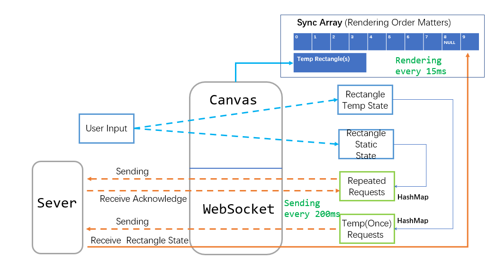
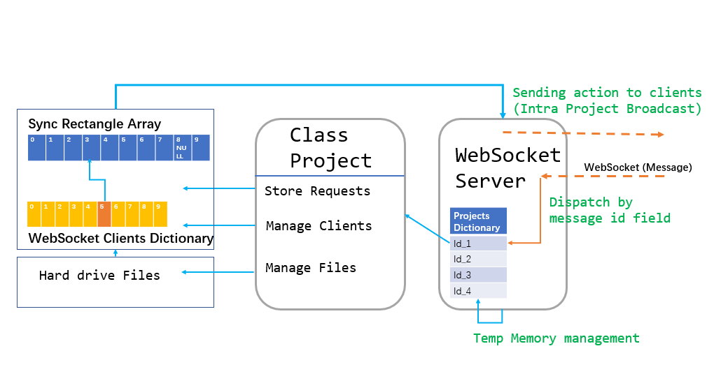

# Multi-Canvas

This is a demo for a Collaboration white board.
Can support multiple person collaborating on the same whiteboard.  
website: <a>https://plan-whiteboard-1.tjuqxb.repl.co/</a>
### Basic functions:

1 Create/save/open projects  
2 Join an online project in real time collaboration  
3 Basic drawing functions include:  
-- Draw rectangles in various sizes  
-- Move rectangles  
-- Delete rectangles  
4 Supports PC and mobile devices

### Digram for Synchronization



### run the app

```console
-- python simpleHttpServer.py
-- python wsserver.py
```

The app is running at http://localhost:5000/  
To test it on mobile device, please change the file `.\static\js\websocketClient.js` line 1:

```JavaScript
let ws = new WebSocket('ws://localhost:9000');
```

Using the local server IP address. The app(static web page) is running at local server port 5000.
